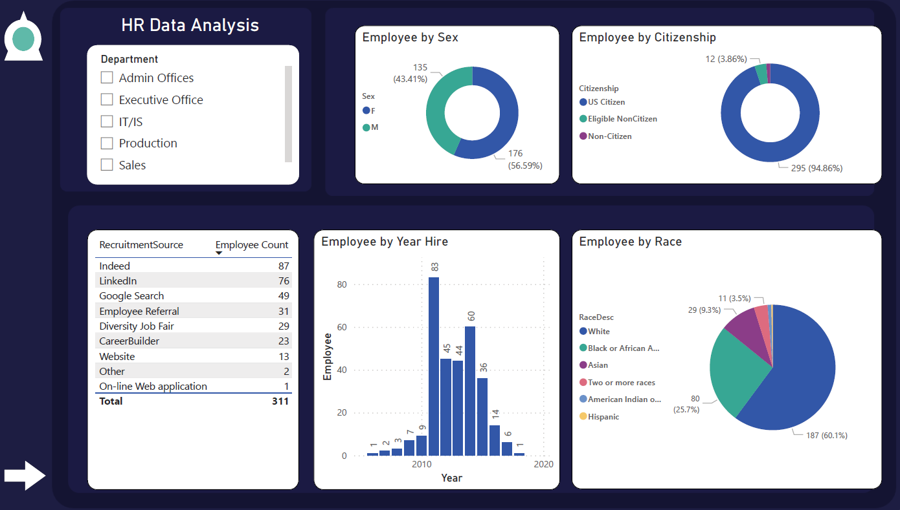

<a name="readme-top"></a>

<div align="center">

  
  <br/>

</div>

<!-- TABLE OF CONTENTS -->

# 📗 Table of Contents

- [📖 About the Project](#about-project)
  - [🛠 Built With](#built-with)
- [💻 Getting Started](#getting-started)
  - [Prerequisites](#prerequisites)
  - [Setup](#setup)
- [👥 Authors](#authors)
- [🤝 Contributing](#contributing)
- [⭐️ Show your support](#support)
- [🙏 Acknowledgements](#acknowledgements)
- [📝 License](#license)

<!-- PROJECT DESCRIPTION -->

# 📖 HR Data Analysis <a name="about-project"></a>

The HR Data Analysis project is a detailed exploration of a sample dataset from an anonymous HR company. Utilizing Power BI, the study uncovers valuable insights, metrics related to the company's recruitment process and employee performance. This comprehensive analysis also showcases my expertise as a data analyst. Through this project, I demonstrate my skills in data extraction, cleansing, modeling, and visualization, illuminating key aspects of HR operations.



</br>

Questions answered with this dashboard

1. What is the distribution of employee's gender in the company? Is the majority US Citizens?

2. What are the most common Recruitment Sources? Has the employee hiring rate decreased over the years?

3. What is the employee's race or ethnicity in the company? How many groups exist?


## 🛠 Built With <a name="built-with"></a>

<details>
  <summary>Tech Stack</summary>
  <ul>
    <li>Power BI</li>
    <li>Power Query</li>
    <li>Microsoft Excel</li>
  </ul>
</details>

<!-- GETTING STARTED -->

## 💻 Getting Started <a name="getting-started"></a>

To get a local copy up and running, follow these steps.

### Prerequisites

- Visual Studio Code
- Basic understanding of Power BI & Power Query
- Git Bash

### Setup

Clone this repository to your desired folder:

```sh
git clone https://github.com/HunterX-7/COVID-19-Data-Analysis.git
```

<!-- AUTHORS -->

## 👥 Author <a name="authors"></a>

👤 **Francisco Quintero**

- GitHub: [@HunterX-7](https://github.com/HunterX-7)
- LinkedIn: [Francisco Quintero](https://www.linkedin.com/in/francisco-asis-quintero-cede%C3%B1o/)

<!-- CONTRIBUTING -->

## 🤝 Contributing <a name="contributing"></a>

Contributions, issues, and feature requests are welcome!

Feel free to check the [issues page](https://github.com/HunterX-7/HR-Data-Analysis/issues).

<!-- SUPPORT -->

## ⭐️ Show your support <a name="support"></a>

Give a ⭐️ if you like this project!

<!-- Acknowledgments -->

## 🙏 Acknowledgments <a name="acknowledgements"></a>

Hat tip to anyone whose code was used.

<!-- LICENSE -->

## 📝 License <a name="license"></a>

This project is [MIT](./LICENSE) licensed.

<p align="right">(<a href="#readme-top">Back to top</a>)</p>
